# Vulkan-Hybrid-PBR-Renderer

**TODO:** Add make file

## Contributors

- [460xlin](https://github.com/460xlin)
- [Zichuanyun](https://github.com/Zichuanyun)

## Quick Links

[Working Repo](https://github.com/460xlin/Vulkan_Hybrid_PBR/)

[Alpah Final Version Slides](https://docs.google.com/presentation/d/1ycHg755oVVsuq8KG6JLaEr2uqga7lePgBr5BQCAu-M0/edit?usp=sharing)

## Overview

This is a Vulkan Hybird PBR ray-raster. To be more specific, a deffered PBR renderer + raytraced shadows.


|PBR (shadow off)| Shadow|
|:-----:|:-----:|
|||

### Key features:

- Deferred rendering
- PBR
- Raytraced shadows for
    - point light
    - IBL diffuse light
    - IBL specular light

## Pipeline

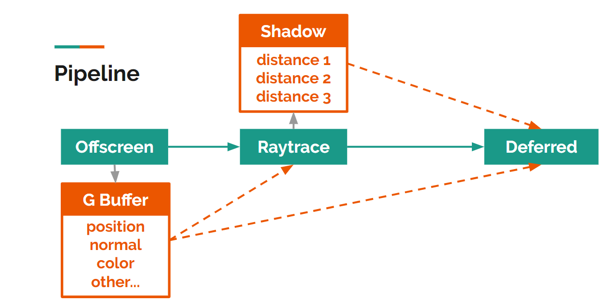

The idea of the pipeline is simple. During the offscreen render pass (the first stage of defferred rendering), information needed by the final dferred render pass is generated and stored in the g buffer. Raytracing pass also takes position and normal as input and ouput shadow map (constructs of three components), which is used as another input source by the final dferred render pass.

### Deferred

#### G Buffer

G buffer stores position, normal and other material information.

|color|position|
|:-----:|:-----:|
|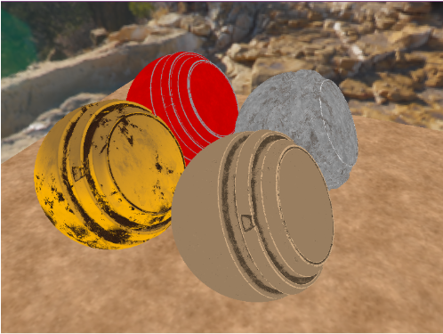|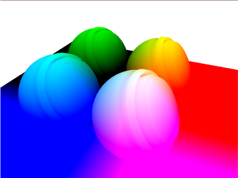|

|normal|matrial|
|:-----:|:-----:|
|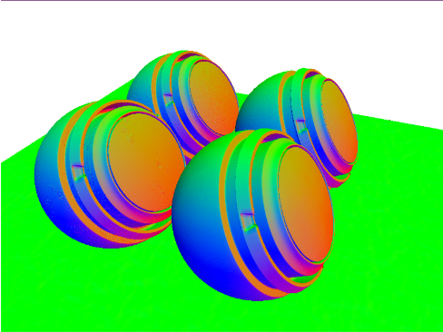|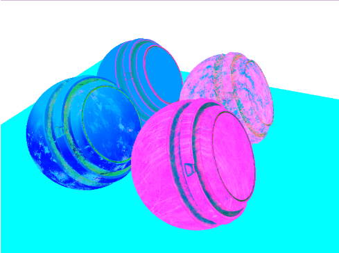|

#### Physically Based Rendering

Metallic, roughness nad ambient occlusion are baked in different channels of one texture.

|albedo|metallic|
|:-----:|:-----:|
||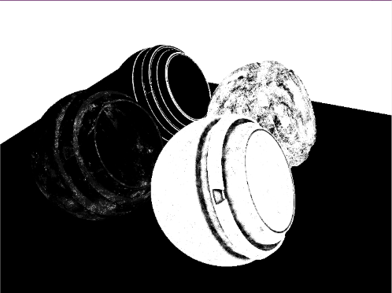|

|roughness|ambient occlusion|
|:-----:|:-----:|
|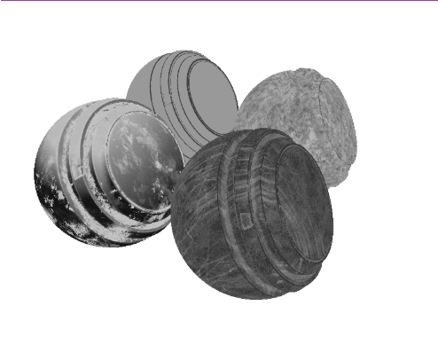|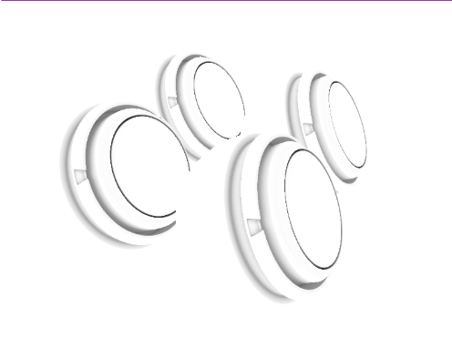|


### Raytraced Shadow

#### Raytracing + Deferred

The idea of ray tacing is simple. The good part of combining deferred rendering and raytracing is that we already have the normal and position of each fragment, which means the the stage of shooting rays from camera is saved for the sake of computation resource.

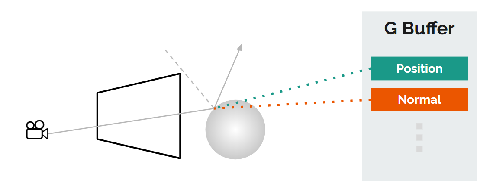

#### PBR toned shadow

When we talk about shadow, we are talking about light and occlusion logic.

```
Shadow = Light + Occlusion Logic
```

In this project, we use ray tracing to find occlusion according to occlusion logic.

There are three light components in our PBR model：

- Direction/Point
- IBL diffuse component
- IBL specular component

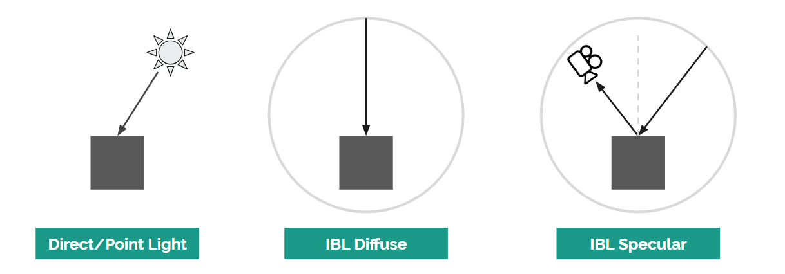

We inverse the light and find location and look for these three types of occlusion with three rays for each fragment.

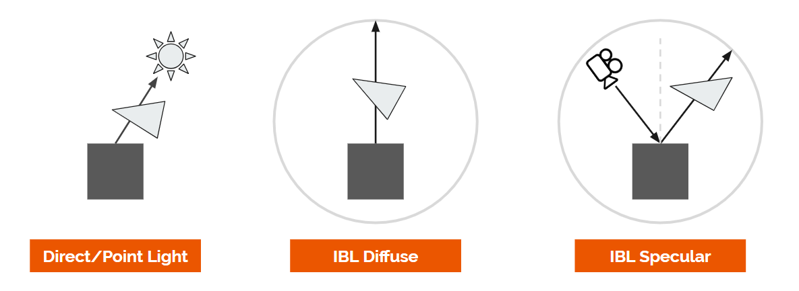


## Credits

- [HybridRenderer](https://github.com/davidgrosman/FinalProject-HybridRenderer)
- [tinyobjloader](https://github.com/syoyo/tinyobjloader)
- [Vulkan Tutorial](https://vulkan-tutorial.com/)
- [SaschaWillems/Vulkan](https://github.com/SaschaWillems/Vulkan)
- [Substance software and workflow](https://www.allegorithmic.com/substance)
- [Khronos gltf PBR](https://github.com/KhronosGroup/glTF-WebGL-PBR)
